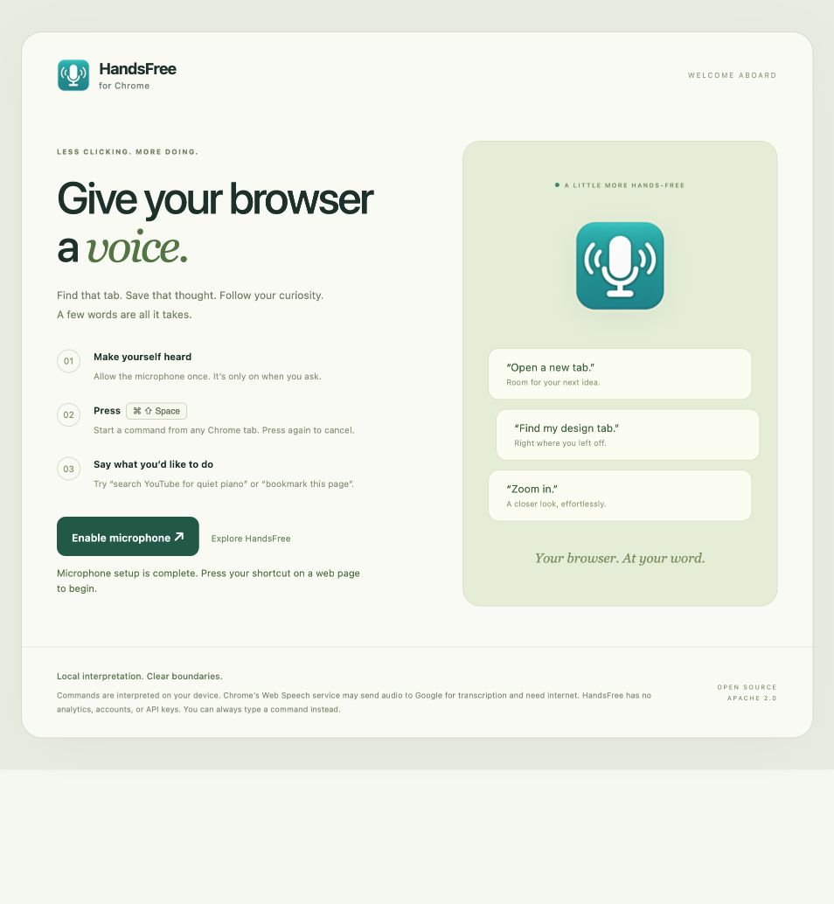
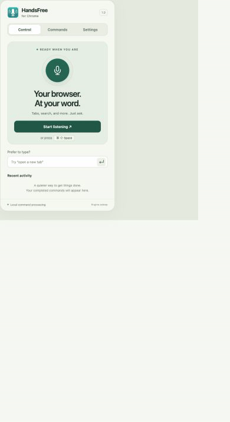
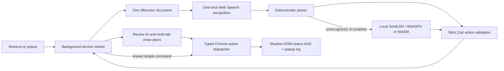

# HandsFree for Chrome

**Your browser. At your word.** An open-source Manifest V3 extension for voice-controlled tabs, windows, search, bookmarks, zoom, and navigation.





The GIF demonstrates the interface using simulated Chrome responses; it is not a recording of live voice control in an installed extension.

## Status

The extension builds locally and includes its icons, strict typed action dispatcher, microphone onboarding, floating Shadow DOM HUD, command guide, local log, settings, and packaged SmolLM2 INT4/INT8 weights. The main command grammar is deterministic. **Local AI is experimental and off by default**: the requested 135M model sometimes copies examples or misinterprets requests. Every AI plan requires review, and invented destination slots are rejected.

Chrome's Web Speech service may send audio to Google and need internet. Command interpretation is local; transcription is not guaranteed to be offline. See [Web Speech recognition behavior](https://developer.mozilla.org/en-US/docs/Web/API/SpeechRecognition). There are no API keys, accounts, analytics, or remote executable assets.

See [validation results and remaining checks](docs/VALIDATION.md). A successful build is not a Chrome Web Store approval or proof that the extension has been installed in your Chrome profile.

## Install locally

The ready-to-load extension is the **`dist` directory**, not the repository root or ZIP.

1. Open `chrome://extensions` in desktop Chrome.
2. Enable **Developer mode**.
3. Select **Load unpacked**, then choose this project's `dist` directory.
4. Pin **HandsFree for Chrome** in the Extensions menu.
5. On the welcome page, select **Enable microphone**, then allow Chrome's microphone prompt.
6. Open a normal web page and press **⌘ Shift Space** on macOS or **Ctrl Shift Space** on Windows/Linux.

Say “open a new tab” to start. Press the shortcut again to cancel. You can also type commands in the popup without microphone permission. Use Settings → Change shortcut to resolve an OS/extension conflict. The default shortcut is active while Chrome is focused; Chrome lets you change its scope in its shortcuts UI.

After rebuilding, press Reload on the extension's `chrome://extensions` card. Do not move or delete `dist` while the unpacked extension is installed. Restricted pages such as `chrome://` pages and the Chrome Web Store cannot display the HUD; the toolbar badge and popup still report status.

## Commands

| Say or type | What happens |
| --- | --- |
| Open a new tab | Opens Chrome's new-tab page. |
| Open example.com | Opens an HTTP(S) website. |
| Open a new tab, open Google search and search for cats & dogs | One tab with a correctly encoded Google search. |
| Search YouTube for quiet piano | Searches YouTube. GitHub search also works. |
| Switch to tab containing design notes | Fuzzy title/URL match across all windows, then focus the matching window and tab. |
| Close this tab / close other tabs / close tabs to the right | Closes the target tabs in the original window; multi-tab closing requires review. |
| Duplicate this tab / hard reload this tab | Duplicates or reloads without cache. |
| Could you silence this tab? / unmute tab | Controls tab audio. |
| Pin this tab / unpin this tab | Controls tab pinning. |
| Maximize window / minimize window / fullscreen / restore window | Changes window state. |
| Zoom in / zoom out / reset zoom / zoom to 125 percent | Changes tab zoom within 25–500%. |
| Bookmark this page as Recipes in Cooking | Saves the current page with a title and folder. |
| Open bookmark recipes / open bookmark number 2 | Opens a matching bookmark or the one-based depth-first bookmark index. |
| Go back / go forward | Navigates this tab's history. |
| Mute tab then pin tab | Executes a validated sequence, stopping on the first failure. |

Commands are anchored to the tab/window active when they begin. Switching tabs during inference does not redirect the pending action. A tab created or found by a sequence becomes its next action's target. Fuzzy matches without a sufficient score produce a visible error instead of selecting an unrelated tab.

An optional trigger phrase is checked **after** you start listening with the shortcut. It is not an always-on wake-word listener. Speech-language presets cover English US/UK/Australia/Canada; the parser and prompts are English.

## Build and test

Node.js 24, npm, and the `zip` command are required.

```sh
npm ci
npm run models:download
npm run check
npm run package
```

Model download fetches approximately 320 MB from the immutable official [SmolLM2 repository](https://huggingface.co/HuggingFaceTB/SmolLM2-135M-Instruct). Files are checked against SHA-256 values in `models/model-lock.json`. Weights are intentionally excluded from Git; the release ZIP includes them. The installed extension never fetches a model or runtime from the network.

`npm run check` runs lint, unit/integration tests, strict type checking, the production build, and manifest/asset checks. `npm run package` creates `release/handsfree-for-chrome.zip` and `release/SHA256SUMS`. CI performs the same steps and uploads a release artifact. Native model evaluation and browser integration details are in [VALIDATION.md](docs/VALIDATION.md).

For a UI-only preview, build and run `node scripts/preview.mjs`, then open `http://127.0.0.1:4173`. The preview uses explicit fixtures, does not run privileged Chrome actions, and is excluded from the release. The offscreen page in that server is a separate real-engine harness with simulated runtime transport.

## Architecture



- `src/background/`: privileged Chrome APIs, serialized state transitions, action dispatch, source checks, offscreen lifecycle and alarms.
- `src/offscreen/`: DOM/audio APIs, speech cancellation, local inference, JSON parsing and slot grounding. Only `chrome.runtime` is used here.
- `src/content/`: an isolated Shadow DOM status pill with one listener per document and reduced-motion support.
- `src/popup/`: setup, controls, settings, keyboard-shortcut link, command examples, activity and review UI.
- `src/common/`: runtime schemas, discriminated message unions, constants and deterministic command grammar.

Vite/Rollup builds module entry points and a separate self-contained IIFE content script. Tailwind utilities and component styles are compiled locally; HUD styles stay inside its Shadow Root. JavaScript and ONNX Runtime's `.mjs`/`.wasm` files are bundled under a self-only CSP with `wasm-unsafe-eval`. The latter enables WebAssembly compilation, not JavaScript eval.

## Resource management

Power Saver closes the offscreen document after three minutes of inactivity via `chrome.alarms`; a service-worker `setTimeout` is not relied upon. Standby retains the engine but never keeps the microphone listening between commands. A two-minute watchdog cancels stuck requests. Lifecycle transitions are serialized, and `runtime.getContexts` is checked before creating an offscreen document.

Speech ends after a result, error, cancellation, or 20-second limit. Setup streams immediately stop all tracks. Model initialization prewarms one token. Each generation starts with fresh input and never returns/stores a KV cache. GPU initialization errors attempt local INT8 WASM fallback; cross-origin isolation enables up to four WASM threads, otherwise one thread is used. Cancellation attempts graceful disposal and closes the document after a bounded grace period.

Logs are bounded to 30 entries. Transcripts are opt-in. Messages are schema-validated and accepted only from the expected extension page. Stale request IDs and repeated approval messages cannot replay actions. Full plans are validated before their first side effect. See [PRIVACY.md](PRIVACY.md).

## Model conversion

The checked-in download script uses upstream ONNX files; conversion is not required. For an alternative local conversion, install a compatible Optimum ONNX/PyTorch environment and run:

```sh
python -m venv .venv
. .venv/bin/activate
python -m pip install 'optimum[onnxruntime]' transformers torch
optimum-cli export onnx --model HuggingFaceTB/SmolLM2-135M-Instruct \
  --task text-generation-with-past models/converted
```

This produces an ONNX export, not automatically the validated Transformers.js INT4/INT8 layout. Use the [Transformers.js conversion/quantization guidance](https://huggingface.co/docs/transformers.js/v3.0.0/en/custom_usage), verify tokenizer/config compatibility, and regenerate the checksum lock before replacing weights. Do not rename an unquantized model to a quantized filename.

## Contributing, licensing, and store submission

See [CONTRIBUTING.md](CONTRIBUTING.md), [store preparation](docs/STORE-PREPARATION.md), and [third-party notices](public/THIRD-PARTY-NOTICES.txt). Source code is [Apache-2.0](LICENSE). SmolLM2 and Transformers.js are Apache-2.0; ONNX Runtime and Zod are MIT. The extension is an independent project and is not affiliated with Google.

Technical references: [Chrome offscreen documents](https://developer.chrome.com/docs/extensions/reference/api/offscreen), [extension commands and shortcut restrictions](https://developer.chrome.com/docs/extensions/reference/api/commands), and [Transformers.js WebGPU](https://huggingface.co/docs/transformers.js/guides/webgpu).
